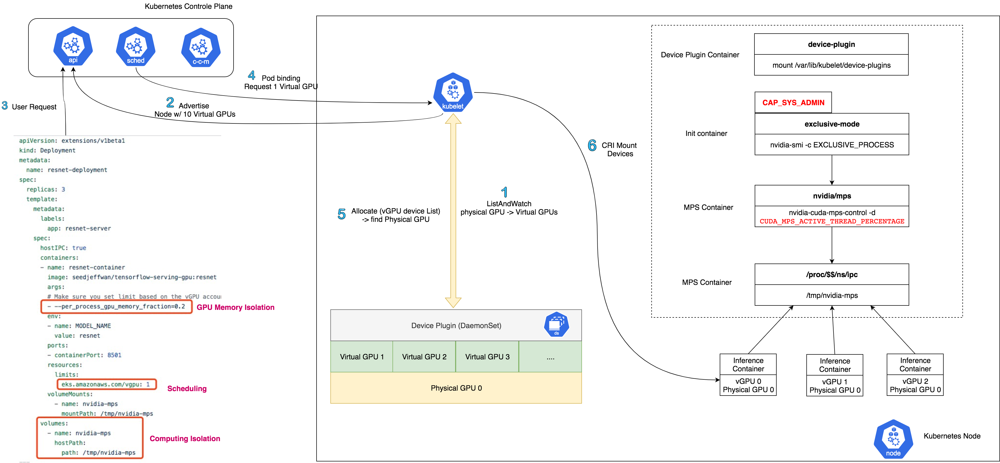

# Virtual GPU device plugin for Kubernetes

The virtual device plugin for Kubernetes is a Daemonset that allows you to automatically:
- Expose arbitrary number of virtual GPUs on GPU nodes of your cluster.
- Run ML serving containers backed by Accelerator with low latency and low cost in your Kubernetes cluster.

This repository contains AWS virtual GPU implementation of the [Kubernetes device plugin](https://github.com/kubernetes/community/blob/master/contributors/design-proposals/resource-management/device-plugin.md).

## Prerequisites

The list of prerequisites for running the virtual device plugin is described below:
* NVIDIA drivers ~= 361.93
* nvidia-docker version > 2.0 (see how to [install](https://github.com/NVIDIA/nvidia-docker) and it's [prerequisites](https://github.com/nvidia/nvidia-docker/wiki/Installation-\(version-2.0\)#prerequisites))
* docker configured with nvidia as the [default runtime](https://github.com/NVIDIA/nvidia-docker/wiki/Advanced-topics#default-runtime).
* Kubernetes version >= 1.10

## Limitations

* This solution is build on top of Volta [Multi-Process Service(MPS)](https://docs.nvidia.com/deploy/pdf/CUDA_Multi_Process_Service_Overview.pdf). You can only use it on instances types with Tesla-V100 or newer. (Only [Amazon EC2 P3 Instances](https://aws.amazon.com/ec2/instance-types/p3/) and [Amazon EC2 G4 Instances](https://aws.amazon.com/ec2/instance-types/g4/) now)
* Virtual GPU device plugin by default set GPU compute mode to `EXCLUSIVE_PROCESS` which means GPU is assigned to MPS process, individual process threads can submit work to GPU concurrently via MPS server. This GPU can not be used for other purpose.
* Virtual GPU device plugin only on single physical GPU instance like P3.2xlarge if you request `k8s.amazonaws.com/vgpu` more than 1 in the workloads.
* Virtual GPU device plugin can not work with [Nvidia device plugin](https://github.com/NVIDIA/k8s-device-plugin) together. You can label nodes and use selector to install Virtual GPU device plugin.

## High Level Design


## Quick Start

### Label GPU node groups

```bash
kubectl label node <your_k8s_node_name> k8s.amazonaws.com/accelerator=vgpu
```

### Enabling virtual GPU Support in Kubernetes

Update node selector label in the manifest file to match with labels of your GPU node group, then apply it to Kubernetes.

```shell
$ kubectl create -f https://raw.githubusercontent.com/awslabs/aws-virtual-gpu-device-plugin/v0.1.1/manifests/device-plugin.yml
```

### Running GPU Jobs

Virtual NVIDIA GPUs can now be consumed via container level resource requirements using the resource name `k8s.amazonaws.com/vgpu`:

```yaml
apiVersion: extensions/v1beta1
kind: Deployment
metadata:
  name: resnet-deployment
spec:
  replicas: 3
  template:
    metadata:
      labels:
        app: resnet-server
    spec:
      # hostIPC is required for MPS communication
      hostIPC: true
      containers:
      - name: resnet-container
        image: seedjeffwan/tensorflow-serving-gpu:resnet
        args:
        # Make sure you set limit based on the vGPU account to avoid tf-serving process occupy all the gpu memory
        - --per_process_gpu_memory_fraction=0.2
        env:
        - name: MODEL_NAME
          value: resnet
        ports:
        - containerPort: 8501
        # Use virtual gpu resource here
        resources:
          limits:
            k8s.amazonaws.com/vgpu: 1
        volumeMounts:
        - name: nvidia-mps
          mountPath: /tmp/nvidia-mps
      volumes:
      - name: nvidia-mps
        hostPath:
          path: /tmp/nvidia-mps
```

> **WARNING:** *if you don't request GPUs when using the device plugin all
> the GPUs on the machine will be exposed inside your container.*

Check the full example [here](./examples/README.md)

## Development

Please check [Development](./DEVELOPMENT.md) for more details.


## Credits

The project idea comes from [@RenaudWasTaken](https://github.com/RenaudWasTaken) comment in [kubernetes/kubernetes#52757](https://github.com/kubernetes/kubernetes/issues/52757#issuecomment-402772200) and Alibaba’s solution from [@cheyang](https://github.com/cheyang)  [GPU Sharing Scheduler Extender Now Supports Fine-Grained Kubernetes Clusters](https://www.alibabacloud.com/blog/gpu-sharing-scheduler-extender-now-supports-fine-grained-kubernetes-clusters_594926).


## Reference

AWS:

- 28 Nov 2018 - [Amazon Elastic Inference – GPU-Powered Deep Learning Inference Acceleration](https://aws.amazon.com/blogs/aws/-amazon-elastic-inference-gpu-powered-deep-learning-inference-acceleration/)
- 2 Dec 2018 - [Amazon Elastic Inference - Reduce Deep Learning inference costs by 75%](https://www.slideshare.net/AmazonWebServices/new-launch-introducing-amazon-elastic-inference-reduce-deep-learning-inference-cost-up-to-75-aim366-aws-reinvent-2018)
- 30 JUL 2019 - [Running Amazon Elastic Inference Workloads on Amazon ECS](https://aws.amazon.com/blogs/machine-learning/running-amazon-elastic-inference-workloads-on-amazon-ecs/)
- 06 SEP 2019 - [Optimizing TensorFlow model serving with Kubernetes and Amazon Elastic Inference](https://aws.amazon.com/blogs/machine-learning/optimizing-tensorflow-model-serving-with-kubernetes-and-amazon-elastic-inference/)
- 03 DEC 2019 - [Introducing Amazon EC2 Inf1 Instances, high performance and the lowest cost machine learning inference in the cloud](https://aws.amazon.com/about-aws/whats-new/2019/12/introducing-amazon-ec2-inf1-instances-high-performance-and-the-lowest-cost-machine-learning-inference-in-the-cloud/)

Community:

- [Nvidia Turing GPU Architecture](https://www.nvidia.com/content/dam/en-zz/Solutions/design-visualization/technologies/turing-architecture/NVIDIA-Turing-Architecture-Whitepaper.pdf)
- [Nvidia Tesla V100 GPU Architecture](https://images.nvidia.com/content/volta-architecture/pdf/volta-architecture-whitepaper.pdf)
- [Is sharing GPU to multiple containers feasible?](https://github.com/kubernetes/kubernetes/issues/52757)
- [Fractional GPUs: Software-based Compute and Memory Bandwidth Reservation for GPUs](http://www.andrew.cmu.edu/user/sakshamj/papers/FGPU_RTAS_2019_Fractional_GPUs_Software_based_Compute_and_Memory_Bandwidth_Reservation_for_GPUs.pdf)
- [GPU Sharing Scheduler Extender Now Supports Fine-Grained Kubernetes Clusters](https://www.alibabacloud.com/blog/gpu-sharing-scheduler-extender-now-supports-fine-grained-kubernetes-clusters_594926)
- [GPU Sharing for Machine Learning Workload on Kubernetes - Henry Zhang & Yang Yu, VMware](https://www.youtube.com/watch?v=T4i33nnSZtc)
- [Deep Learning inference cost optimization practice on Kubernetes - Tencent](https://static.sched.com/hosted_files/kccncosschn19eng/c5/Tencent%20Cloud%20(Chinese%20Ver.)_%E5%9F%BA%E4%BA%8EKubernetes%E8%BF%9B%E8%A1%8C%E6%B7%B1%E5%BA%A6%E5%AD%A6%E4%B9%A0%E8%AE%AD%E7%BB%83%E6%8E%A8%E7%90%86%E7%9A%84%E6%88%90%E6%9C%AC%E4%BC%98%E5%8C%96%E5%AE%9E%E8%B7%B5-KubeCon_China_2019.pdf)
- [Gaia Scheduler: A Kubernetes-Based Scheduler Framework](https://www.semanticscholar.org/paper/Gaia-Scheduler%3A-A-Kubernetes-Based-Scheduler-Song-Deng/bf8badfda7ad15f39cae890a5ab08fd9f4374700)


## License

This project is licensed under the Apache-2.0 License.
